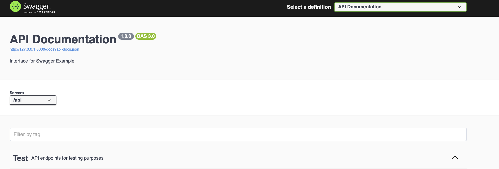
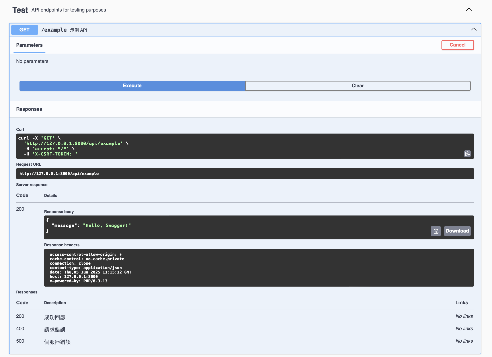

## Laravel + Swagger 整合說明
### 目前使用的版本是Larevel 12
有些使用方式要去看Laravel官方文件
1. **安裝 Swagger 套件**<br>
   使用 Composer 安裝 `darkaonline/l5-swagger`
   ```bash
   composer require "darkaonline/l5-swagger"
   ```

2. **發布配置檔案**<br>
   執行以下命令以生成配置檔案
   ```bash
   php artisan vendor:publish --provider "L5Swagger\L5SwaggerServiceProvider"
   ```
   會產生以下
   ```
   config/
   └── l5-swagger.php
   ```
3. **自定義配置l5-swagger.php** <br>
   可在 `config/l5-swagger.php` 中進行配置, 例如修改路徑或標題
   
   ```php
    'documentations' => [
        'default' => [
            'api' => [
                'title' => 'API Documentation', # 這裡是Swagger UI 的 page title
            ],

            'routes' => [
                /*
                 * Route for accessing api documentation interface
                 * 打上your-url/api/documention 會訪問到你的Swagger UI 
                 */
                'api' => 'api/documentation', // 修改這裡來改變訪問路徑
            ],
            'paths' => [
                /*
                 * Edit to include full URL in ui for assets
					       * 如果env 沒有這些參數會自動帶後面的default value
                 */
                'use_absolute_path' => env('L5_SWAGGER_USE_ABSOLUTE_PATH', true),

                /*
                * Edit to set path where swagger ui assets should be stored
                */
                'swagger_ui_assets_path' => env('L5_SWAGGER_UI_ASSETS_PATH', 'vendor/swagger-api/swagger-ui/dist/'),

                /*
	               * 在/storage那生成api documention
                 * File name of the generated json documentation file
                 */
                'docs_json' => 'api-docs.json',

                /*
                 * File name of the generated YAML documentation file
                 */
                'docs_yaml' => 'api-docs.yaml',

                /*
	               * 這邊決定你要生成的檔案類型
                 * Set this to `json` or `yaml` to determine which documentation file to use in UI
                 */
                'format_to_use_for_docs' => env('L5_FORMAT_TO_USE_FOR_DOCS', 'json'),

                /*
                 * Absolute paths to directory containing the swagger annotations are stored.
                 */
                'annotations' => [
		                /*
			                生成Swagger 文件時 會掃過/app底下的所有資料夾&files
		                */
                    base_path('app'),
                ],
            ],
        ],
   ```
4. **生成 API 文件** <br>
   執行以下命令生成 Swagger 文件
   ```bash
   php artisan l5-swagger:generate
   ```
   但每次更改需要下這個指令去更新Swagger <br>
   如果要自動生成 Swagger 文件, 則在`.env`加入
   ```
   L5_SWAGGER_GENERATE_ALWAYS=true
   ```
5. **訪問 Swagger UI**<br>
   預設情況下, Swagger UI 可通過以下 URL 訪問
   ```
   http://your-app-url/api/documentation
   ```
   需要修改的話到 `/config/l5-swagger.php` <br>
   **如何修改訪問路徑：**
   - 更改 Swagger UI 的訪問路徑，例如改為 `api/docs`, 只需將 `'api/documentation'` 修改為 `'api/docs'`：
     ```php
     'routes' => [
         'api' => 'api/docs',
     ],
     ```
   - 修改後, swagger UI 的訪問 URL 將變為：
     ```
     http://your-app-url/api/docs
     ```
## Swagger 使用方式
1. **在`app/Http/Controllers.php` 加入`@OA\Info`**
    
    <span style="color:blue;">`@OA\Info` 需要加入才能生成Swagger 文件</span>
    
    - title: Swagger UI的標題
    - version: API 版本
    - description: API 介面的描述
    ```php
    namespace App\Http\Controllers;
    /**
    * @OA\Info(
    *     title="API Documentation",
    *     version="1.0.0",
    *     description="Interface for Swagger Example",
    * )
    * @OA\Tag(
    *     name="Test",
    *     description="API endpoints for testing purposes"
    * )
    *
    */

    abstract class Controller
    {
        //
    }
    ```

    


2. **加入 `@OA\Tag`**
    +  用途是可以分類各種API, 寫在`Controller.php`的原因是因為不用寫在各別的Controller裡好方便整理
    +  如果API沒有使用tag的話(例如下面的Tag), 則會被自動分類到**default**
    
    ```php
    namespace App\Http\Controllers;

    use Illuminate\Http\Request;

    /**
     * @OA\Get(
     *     path="/example",
     *     tags={"Test"},
     *     summary="示例 API",
     *     @OA\Response(
     *         response=200,
     *         description="成功回應"
     *     ),
     *     @OA\Response(
     *         response=200,
     *         description="成功回應"
     *     ),
     *     @OA\Response(
     *         response=400,
     *         description="請求錯誤"
     *     ),
     *     @OA\Response(
     *         response=500,
     *         description="伺服器錯誤"
     *     )
     * )
     */
    class TestController extends Controller
    {
        public function example(Request $request)
        {
            return response()->json(['message' => 'Hello, Swagger!']);
        }
    }
    ```
3. **Swagger 常見註解**
    - `@OA\Get`：用於獲取資源。
    - `@OA\Post`：用於創建資源。
    - `@OA\Put`：用於更新資源。
    - `@OA\Delete`：用於刪除資源。
    - `@OA\Patch`：用於部分更新資源。
    - `@OA\Parameter` : 用於定義路徑參數或查詢參數。
    - `@OA\RequestBody`: 用於定義請求的 JSON 或表單數據。
    - `@OA\Response`: 用於定義 API 的回應

    這些註解可以完整地描述 API 的行為, 例如上面的是一隻`GET`的api

    

### 注意
<span style="color:orange; font-weight:bold;">**Laravel 12 初始專案拿掉 api.php**</span>
```
   routes/
   └── api.php
```

需要再下指令再產生檔案, 自己新建`api.php`是無法使用api的
```bash
php artisan install:api
```
檢查的話可以透過
```bash
php artisan route:list
```
### 參考資源
- [L5 Swagger 官方文件](https://github.com/DarkaOnLine/L5-Swagger)
- [Laravel 官方文件](https://laravel.com/docs)
